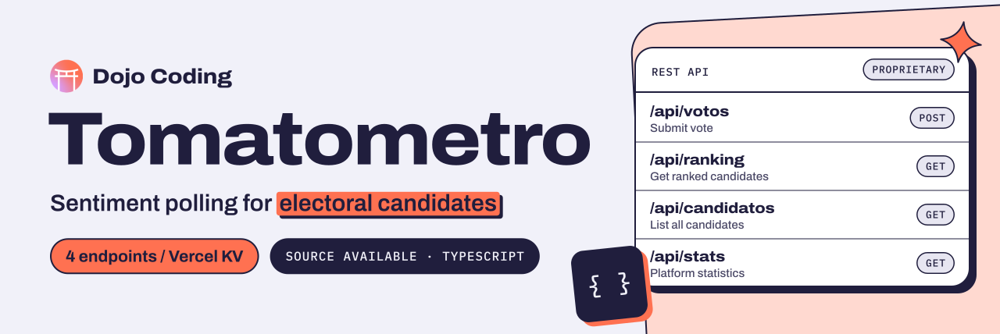

<p align="center">
  <a href="https://dojocoding.io">
    <picture>
      <source media="(prefers-color-scheme: dark)" srcset="docs/assets/banner-dark.svg">
      <source media="(prefers-color-scheme: light)" srcset="docs/assets/banner-light.svg">
      
    </picture>
  </a>
</p>

# Tomatometro

**The voting, scoring and ranking API of Tomatometro, where the public rates electoral candidates as fresh or rotten.**

Public sentiment polling platform for electoral candidates.

[](#license) [](#stack) [](#stack)

[API endpoints](#api-endpoints) · [Scoring](#scoring) · [Architecture](#architecture) · [Report an issue](https://github.com/DojoCodingLabs/tomatometro-public/issues/new)

## Stack

- Next.js 16
- TypeScript
- Vercel KV (Redis)

## Architecture

```
src/
├── data/           # Static data (candidates, debates)
├── lib/            # Core logic (scoring, storage)
├── app/api/        # REST endpoints
└── types/          # TypeScript definitions
```

## API Endpoints

| Endpoint | Method | Description |
|----------|--------|-------------|
| `/api/votos` | POST | Submit vote |
| `/api/ranking` | GET | Get ranked candidates |
| `/api/candidatos` | GET | List all candidates |
| `/api/stats` | GET | Platform statistics |

## Scoring

```typescript
score = (frescos / (frescos + podridos)) * 100
```

Default score when no votes: 50

## Rate Limiting

- 100 votes per hour per device fingerprint
- Session-based duplicate vote prevention (24h TTL)

## Environment Variables

```bash
KV_REST_API_URL=
KV_REST_API_TOKEN=
KV_REST_API_READ_ONLY_TOKEN=
```

## License

Proprietary. Built by [Dojo Coding](https://dojocoding.io).

<p align="center">
  <a href="https://dojocoding.io"></a>
</p>
